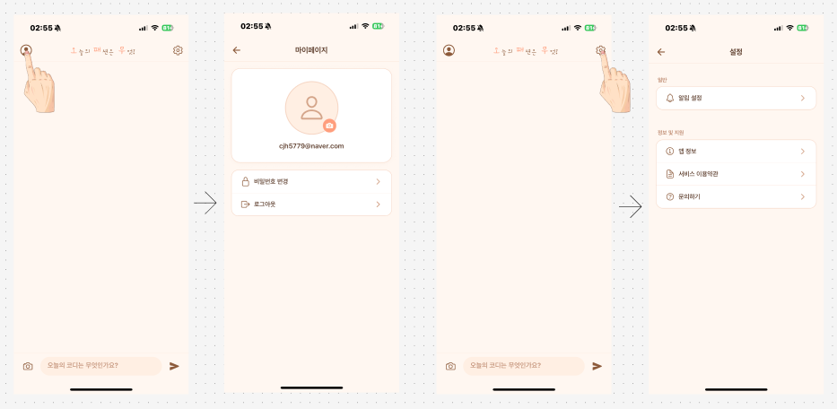
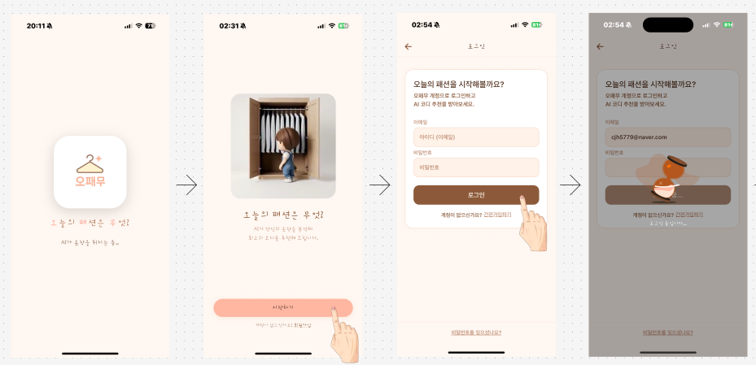
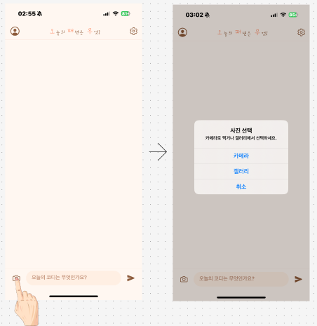
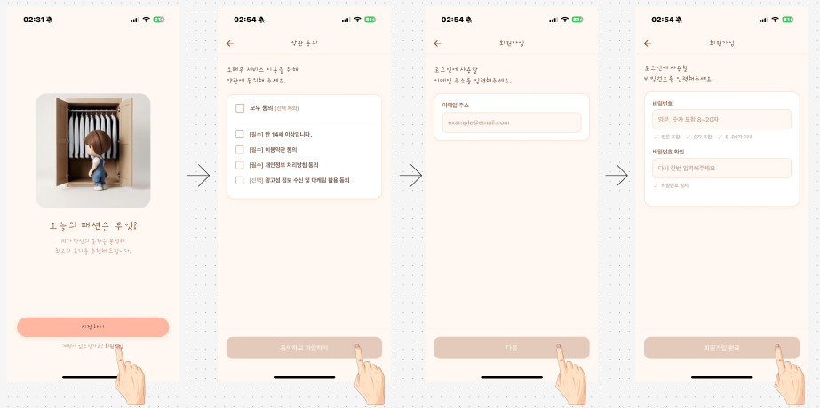
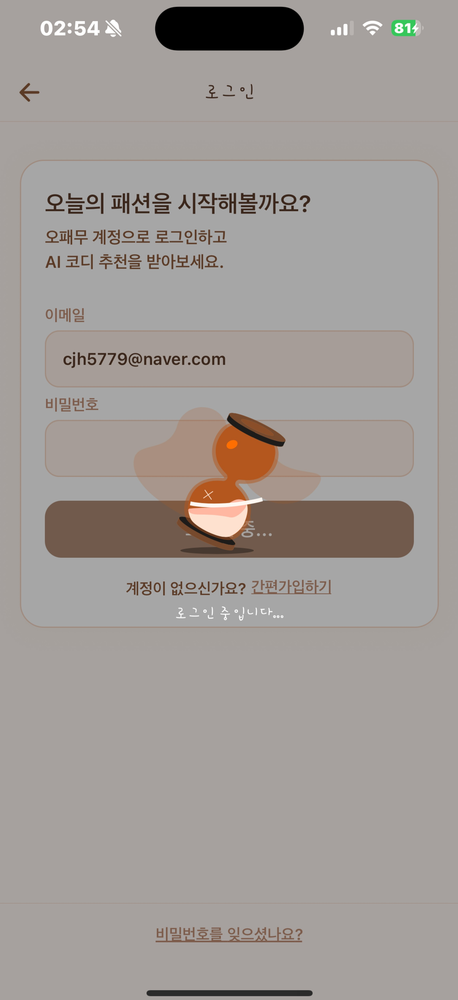

  
### Hambugi Team

 

 

## 📝 소개
### **나만의 AI 스타일리스트, 스마트한 패션의 완성 'Hambugi (햄부기)'**

사용자의 전신 이미지를 분석하여 객관적인 패션 평가와 최적의 코디를 추천해 주는 AI 기반 모바일 애플리케이션입니다. React Native를 활용해 사용자가 마치 실제 AI 스타일리스트와 대화하듯 자연스럽게 피드백을 받을 수 있는 대화형 UI를 제공합니다.

 

## 💡 기획 배경 및 필요성

### 1. 과제 수행 배경
최근 패션에 대한 관심은 20·30대에 국한되지 않고 청소년층까지 폭넓게 확대되고 있습니다. 많은 사람들이 자신의 스타일을 꾸미는 데 관심을 갖고 있음에도, 온라인에는 코디 관련 정보가 지나치게 방대하여 실제로 **‘사람이 입은 전신 코디’**를 일관된 기준으로 비교하고 검색하기가 쉽지 않은 상황입니다.

### 2. 서비스의 필요성
* **패션 자신감 향상**  
  AI 기반 패션 평가 모델을 활용하면 사용자는 보편적인 패션 기준에 따른 객관적인 평가를 받을 수 있습니다. 이를 통해 자신의 스타일 강점과 보완점에 대해 구체적인 방향을 제시받고, 일상생활에서 패션에 대한 자신감과 자기효능감을 높일 수 있습니다.
* **객관적이고 설명 가능한 피드백**  
  전신 사진을 바탕으로 유사 코디의 분포, 공통된 특징 등을 정량적으로 시각화하여 제시함으로써, 사용자는 바로 적용 가능한 개선 포인트를 얻을 수 있습니다. 스스로 스타일을 설계하고 조정할 수 있는 능력이 강화됩니다.
* **차별화된 대화형 모바일 UI 제공**  
  기존 패션 서비스들은 스타일 팁은 많지만, 복잡한 분석 결과(점수, 카테고리, 추천 멘트 등)를 한눈에 이해하기 어려운 피드형/웹 UI가 대부분입니다. 이를 해결하기 위해 본 프로젝트는 챗봇 형태의 **대화형 UI**를 도입하여, 개인별 히스토리를 고려한 맞춤형 사용자 경험(UX)을 모바일 앱으로 구현했습니다.

 

## 🗺️ 유저 플로우 (User Flow)

Figma를 활용하여 설계한 앱의 핵심 화면 이동 흐름입니다. 각 기능별로 사용자의 동선을 직관적으로 기획했습니다.

| 회원가입 플로우 | 로그인 플로우 |
| :---: | :---: |
|  |  |
| **약관 동의 및 계정 생성** | **스플래시 화면 및 로그인 진행** |

| 사진 업로드 플로우 | 마이페이지 및 설정 |
| :---: | :---: |
|  |  |
| **카메라/갤러리 접근 및 사진 선택** | **사용자 프로필 확인 및 앱 설정** |

 

## 📱 앱 화면 및 주요 기능 (Features)

| 메인 (시작 화면) | 로그인 화면 | AI 분석 로딩 화면 | AI 분석 및 추천 결과 |
| :---: | :---: | :---: | :---: |
|  |  |  |  |

* **주요 기능**
  * **전신 코디 업로드:** 디바이스 갤러리 및 카메라 접근을 통한 직관적인 사진 업로드
  * **AI 스타일리스트 챗봇 UI:** 딱딱한 통계 화면이 아닌, 친근한 대화형 인터페이스를 통한 결과 리포트 제공
  * **크로스 플랫폼 최적화:** React Native와 Expo를 활용하여 iOS와 Android 양대 마켓 환경에 맞춘 UI/UX 퍼블리싱

 

## ⚙ 기술 스택 (Tech Stack)

### Front-end & Mobile
  

### Design & Tools
  

 

## 🤔 자체 평가 (Review)

### ✨ 잘한 점
* 복잡할 수 있는 AI 분석 결과 데이터를 사용자가 거부감 없이 쉽게 받아들일 수 있도록, 모바일 환경에 최적화된 '대화형 챗봇 UI'로 기획하고 퍼블리싱해낸 점이 가장 큰 성과입니다.
* React Native와 Expo를 도입하여 짧은 프로젝트 기간 내에 모바일 프론트엔드의 기초 뼈대를 탄탄하게 구축하고 화면 전환(Navigation)을 매끄럽게 구현했습니다.

### 💦 아쉬운 점 및 개선 목표
* 패션 이미지를 정량적으로 분석하고 평가하는 AI 모델의 기술적 난이도가 높고 학습 시간이 많이 소요되어, 기한 내에 AI 백엔드 서버와의 완벽한 실시간 연동 및 최종 기능 구현을 100% 끝마치지 못한 점이 가장 아쉽습니다.
* 현재 프론트엔드 UI/UX 기획과 뷰(View) 단의 구현은 완성되었으나, 추후 AI 모델을 고도화하고 REST API 연동을 성공적으로 마쳐 실제 서비스가 가능한 수준의 앱으로 끌어올리는 것이 최종 목표입니다.

 

## 💁‍♂️ 프로젝트 팀원

| 최정환 (Front-End) | 김영준 (AI / Back-End) | 장종원 (AI / Back-End) |
| :---: | :---: | :---: |
|  |  |  |
| [@cjh5779](https://github.com/cjh5779) | [@youngjoon0405](https://github.com/youngjoon0405) | [@milue12](https://github.com/milue12) |
